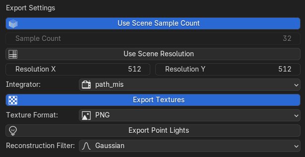
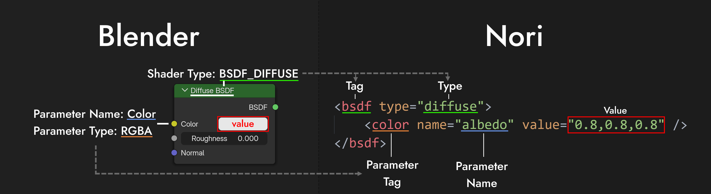

A Blender to [Nori](https://github.com/wjakob/nori) export plugin. Inspired by [BlenderNoriPlugin](https://github.com/Phil26AT/BlenderNoriPlugin) but written from scratch for Blender 4.5+ with some additional features.

## Features

- Exports Blender scenes to Nori (XML) format
- Exports meshes as obj
    - Supports meshes with multiple materials
- Exports basic materials (diffuse, glossy/microfacet)
- Exports emissive materials as area lights
- Option to export all referenced image textures as PNG or JPEG
- Simple settings for resolution, SPP, integrator, reconstruction filter, etc.
- Easily extensible for other simple nodes/shaders
- Export point lights

## Installation

1. Download the latest release from the [releases page](https://github.com/TheCodecOfficial/Bento/releases/latest).
2. In Blender, go to `Edit > Preferences > Add-ons > Install...`
3. Select the downloaded ZIP file and click `Install Add-on`.
4. Enable the add-on by checking the box next to "Bento" in the add-ons list.
5. Save preferences if desired.

## Usage

To export a scene as a Nori XML, first make sure you're in object mode. Then go to `File > Export > Nori (.xml)`. Choose a path and filename, and adjust the export settings as needed. Then click `Export Nori XML`.

## Limitations

### Shaders

Currently, only diffuse and glossy (microfacet) shaders are supported. Glossy shaders with a very low roughness will get converted to a mirror shader in Nori.

> [!NOTE]
> Blender's glossy shader doesn't have a diffuse lobe. To get equivalent behavior in Nori, kd automatically gets set to black (0, 0, 0). Also, the color parameter of Blender's glossy shader has no counterpart in Nori's microfacet shader, so it will be ignored. Set it to white (1, 1, 1) to match Nori's behavior (the default in blender is (0.8, 0.8, 0.8)!). Finally, set the distribution to "Beckmann" to match Nori's implementation.

### Lights

Only point lights and emission shaders are supported.

### Textures

There is an option to export all textures, but no texture tags are created in the XML since image textures are not a part of Nori's default feature set. You will need to implement this yourself if you need it.

There is limited support for checkerboard textures.

> [!TIP]
> The script automatically generates a relative path to each texture (see the `handle_special_cases` function in `export_materials.py`). If you implement image textures in Nori, you can use that path to load the texture.

## Extending Shader Support

> [!TIP]
> Simple shaders that have a direct mapping between Blender and Nori can be added by modifying the mappings inside the Bento config 'config.yaml'. Go to `Edit > Preferences > Add-ons > Bento` to see the config path.

The config file consists of four mappings used to translate Blender concepts to Nori concepts:

- `node_tag_map`: Maps Blender shader node types to Nori **tags**. Examples:
    - `BSDF_DIFFUSE` -> `bsdf`
    - `BSDF_GLOSSY` -> `bsdf`
    - `TEX_CHECKER` -> `texture`
    - `EMISSION` -> `emitter`
- `node_map`: Maps Blender shader node types to Nori **types**. Examples:
    - `BSDF_DIFFUSE` -> `diffuse`
    - `BSDF_GLOSSY` -> `microfacet`
    - `TEX_CHECKER` -> `checkerboard`
    - `EMISSION` -> `area`
- `parameter_map`: Maps Blender shader node parameters to Nori **parameter names**. Examples:
    - `Color` -> `albedo` (Diffuse shader)
    - `Color1` -> `value1` (Checker texture)
- `type_map`: Maps Blender shader node parameter types to Nori **parameter tags**. Examples:
    - `RGBA` -> `color`
    - `VALUE` -> `float`

Complete example (Diffuse shader):

| Blender                       | Nori                           | Conversion done by |
| ----------------------------- | ------------------------------ | ------------------ |
| BSDF_DIFFUSE (Node type)      | <**bsdf** ...> (tag)               | node_tag_map       |
| BSDF_DIFFUSE (Node type)      | \<bsdf type="**diffuse**" /> (type) | node_map           |
| Color (Diffuse parameter)     | \<color name="**albedo**" /> (name) | parameter_map      |
| RGBA (Blender parameter type) | <**color** ...> (tag)    | type_map           |

> [!NOTE]
> Many parameters cannot be mapped one-to-one due to differences in how Blender and Nori handle certain concepts. For example, Blender's Glossy shader has a "Roughness" parameter, while Nori's Microfacet shader uses "alpha" (roughness squared). Conversions like this need to be implemented directly in the code (roughness to alpha conversion is already implemented).